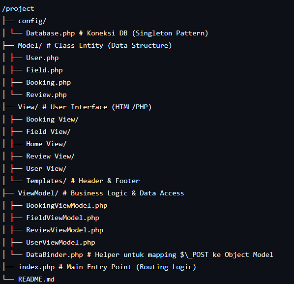

# TP10DPBO2425C2

# RexSport Arena

**RexSport Arena** adalah sistem manajemen penyewaan lapangan olahraga berbasis web (Web-based Sport Venue Booking System). Aplikasi ini dibangun menggunakan **Native PHP** dengan pendekatan arsitektur **MVVM (Model-View-ViewModel)** untuk memastikan kode yang rapi, terstruktur, dan mudah dikembangkan.

## Fitur Utama

1.  **Dashboard Informatif**: Menampilkan statistik total member, lapangan, booking, dan review secara _real-time_.
2.  **Manajemen Member (CRUD)**: Registrasi, edit data, dan hapus member.
3.  **Manajemen Lapangan (CRUD)**: Menambah, mengedit, dan menghapus data lapangan beserta harga sewanya.
4.  **Sistem Booking (CRUD)**:
    - Mencatat transaksi penyewaan.
    - **Kalkulasi Otomatis**: Menghitung total harga berdasarkan durasi dan harga lapangan.
5.  **Sistem Review & Rating**:
    - Memberikan ulasan bintang (1-5) pada booking yang telah dilakukan.
    - Fitur Edit dan Hapus ulasan.

## Desain & Arsitektur Program

Proyek ini tidak menggunakan framework bawaan (seperti Laravel/CI), melainkan mengimplementasikan pola desain sendiri yaitu **MVVM (Model-View-ViewModel)** dengan struktur sebagai berikut:

### 1. Pola Desain (Pattern)

- **Model**: Representasi struktur data (Blueprints). Hanya berisi properti tanpa logika bisnis yang berat.
  - _Contoh:_ `User.php`, `Field.php`, `Booking.php`.
- **View**: Antarmuka pengguna (UI). Berisi HTML dan sedikit PHP untuk menampilkan data.
  - _Contoh:_ `HomeView.html`, `BookingForm.php`, `BookingList.php`.
- **ViewModel**: Jembatan antara Database dan View. Menangani logika bisnis, query database, dan pemrosesan data.
  - _Contoh:_ `UserViewModel.php` (Handle logika user), `BookingViewModel.php` (Handle logika booking & hitung harga).

### 2. Struktur Folder

## Alur Program

Sistem ini menggunakan Single Entry Point di index.php. Artinya, semua request dari user akan diproses pertama kali oleh file ini.

Logika Routing
URL dikendalikan oleh parameter page dan action. Contoh URL: index.php?page=bookings&action=edit&id=5

Langkah-langkah Alur Kerja:

Inisialisasi:

index.php memuat dependensi (Database, ViewModel).

Database.php secara otomatis mengecek dan membuat tabel jika belum ada.

Routing (Switch Case):

Sistem mengecek $\_GET['page'].

Jika page=bookings, sistem memanggil BookingViewModel.

Action Handling (CRUD Logic):

Sistem mengecek $\_GET['action'] dan Request Method.

Read: Jika tidak ada action, ViewModel memuat data (loadData()) dan menampilkan List View.

Create/Update (POST):

Data dari form dikirim ke index.php.

DataBinder memetakan array $\_POST menjadi Objek Model.

ViewModel menyimpan objek tersebut ke Database (INSERT atau UPDATE).

Delete: ViewModel menghapus data berdasarkan ID dari URL.

Edit Form: ViewModel mengambil satu data spesifik (getById) dan mengirimnya ke Form View untuk diisi otomatis.

Rendering View:

Setelah logika selesai, index.php melakukan include file View yang sesuai (misal: BookingList.php atau BookingForm.php) untuk ditampilkan ke browser pengguna.

## Skema Database

Database menggunakan MySQL dengan nama rexsport.

users: id (PK), nama, email, role (enum: member).

fields: id (PK), nama_lapangan, jenis, harga_per_jam.

bookings: id (PK), user_id (FK -> users), field_id (FK -> fields), tanggal, durasi, total_harga.

reviews: id (PK), booking_id (FK -> bookings), rating, komentar.
